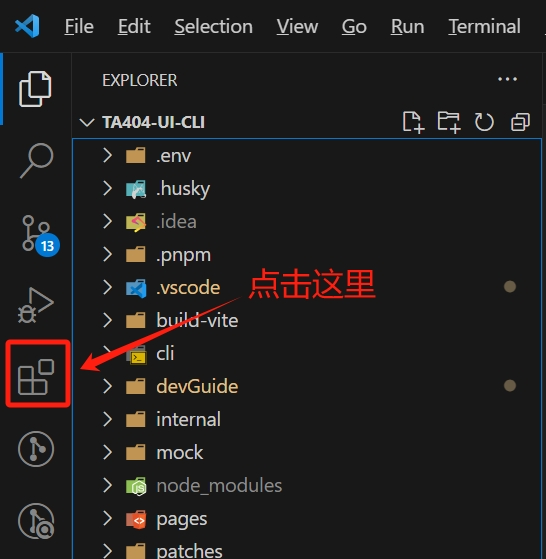
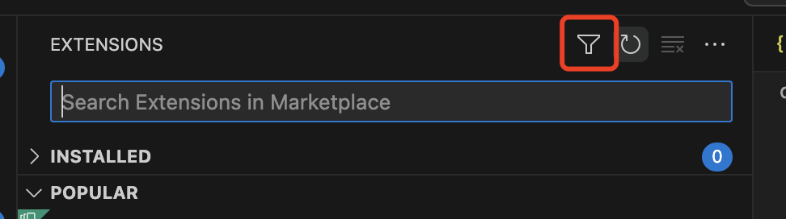
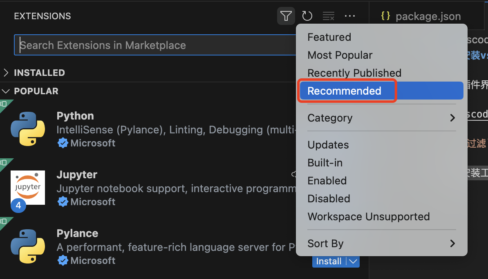
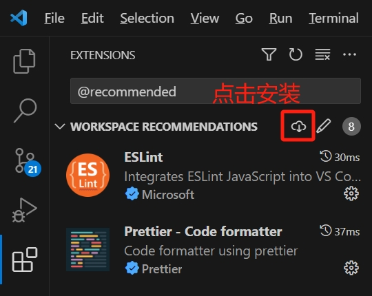
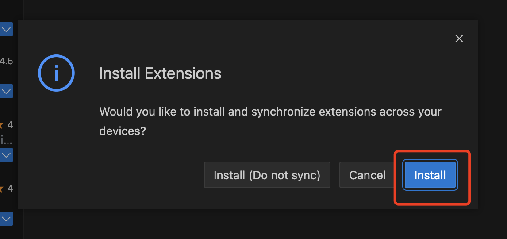

# VS Code 推荐插件

为了提升开发效率，同时提供必要的代码检查功能，我们在框架中内置了一套推荐的插件（详见 `.vscode/extensions.json`）。

## 如何安装 VS Code 的工作区推荐插件

1. 打开插件界面

2. 点击 `过滤` 图标，然后选择 `推荐`

3. 点击 `安装工作区推荐插件` 按钮

4. 点击 `install` 确认安装推荐插件

