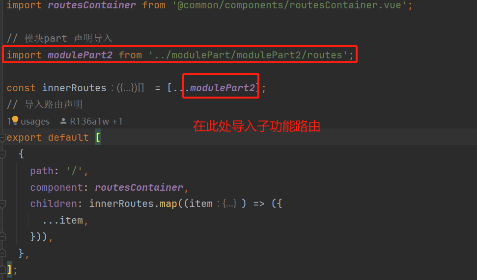
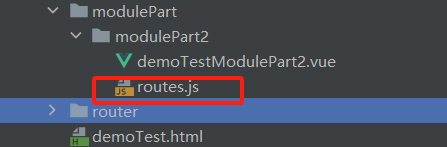

## Vue-Router规范  
框架为多模块单页面应用，在一个模块中书写路由时，应遵循一定的规范。

### routes.js文件
#### 1、 每个模块有一个模块级的router文件夹，此处是整个模块的总路由，所有的子功能路由都需要再此处导入后才可使用。


#### 2、 在模块的每个子功能中都有自己的路由文件routes.js，每个功能的页面路由只需在此处配置即可。


## 路由书写规范
一般开发人员只需在功能模块的routes.js中将自己的vue页面导入并配置即可。此文件需导出一个路由数组。  
每个路由配置应当由以下几个配置组成  
- title： 页面的标题
- name： vue页面的对应路由名称，router会通过此配置来匹配相应的页面，此配置应当与vue页面的name一致
- path：vue页面的对应路由路径，在此框架中可省略或者应当与name一致
- component：对应的具体vue页面，建议使用路由懒加载的模式写法，引入的vue文件路径应当正确
- children(可选)： 如果拥有子页面，那么子页面的配置将放children中
```js
export default [
{
title: '项目模块实例part 2',
name: 'modulePart2', // 应当与vue页面的name一致
path: 'modulePart2', // 应当与vue页面的name一致
component: () => import('./demoTestModulePart2.vue'),  // 具体的页面引入,懒加载模式
children: [ // 子路由
...
]
},
];
```
