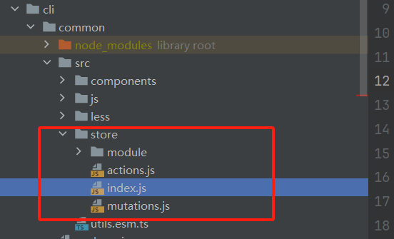
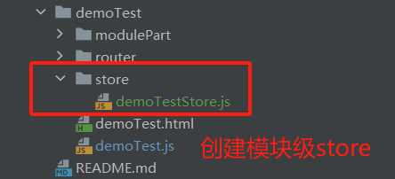

## vuex规范
框架支持使用vuex来进行状态管理，在模块需要传递的数据比较复杂时，此时可以使用vuex来进行数据状态管理。

### 项目store介绍
#### 1、框架顶级store
在业务组件中使用vuex时，需要从public-ant-modules.js中引入框架顶级的store，所有的子模块的store应当是此顶级store的子模块。
框架store 在cli/common/src/store中，开发中一般不会去更改里面的内容。

#### 2、模块store
每个模块在需要vuex状态管理时，应当创建当前模块自己的store


### 模块store规范
一般在开发功能时，以模块为粒度进行开发，所以在需要状态管理时，应当只关注当前模块的store即可。
#### 1、 在模块下创建模块级store
在模块下创建store文件夹，文件夹下创建模块store的JS，名称建议: 模块名称+Store.js
 

在创建模块级store中时，应当使用命名空间模式（namespaced: true）,store中应当包含以下几个概念：  
- state：存放数据状态的配置
- mutation：操作state中数据的唯一方式，开发者想更改state数据可调用此方式
- action：类似mutation，但是此action支持异步操作。它也必须通过mutation来操作state
- getter： 当需要从state中派生出一些状态时，可用此方法暴露出去使用
```js
export default {
namespaced: true,
state: {
age: 0, // 数据状态
},
mutations: {
// 更改state中age的唯一方式

    _setStateAge(state, value) {
      state.age = value;
    },
},
actions: {
// 提交的是commit
setStateAge({ commit }, value) {
commit('_setStateAge', value);
},
},
getters: {
// 派生出age+1的状态
getAge(state) {
return state.age + 1;
},
},
};
```

#### 2、 模块级store注册
在入口文件中引入创建的store，从public-ant-modules.js中引入store，并且注册   
```js
import { Vue, store, taMixins, checkLogin } from '@common/js/public-ant-modules'; // 引入公共文件

// 引入创建的模块级store
import demoTestStore from './store/demoTestStore.js';
// 注册store模块
store.registerModule('demoTestStore', demoTestStore);

new Vue({
mixins: [taMixins],
router,
store,
// render: h => h(app),
}).$mount('#app');
```

#### 3、 使用store
注册完后，可以在vue页面中使用  
可以通过$store来使用。但是更推荐使用vuex的辅助函数（mapState, mapMutations, mapActions, mapGetters）来使用  
```js
<template>
  <div>
    <ta-button @click="change">改变</ta-button>
    <h1>年龄：{{ age }}</h1>
  </div>
</template>

<script>
import { mapState, mapMutations, mapActions, mapGetters } from 'vuex';
export default {
  name: 'modulepart2',
  computed: {
    // 使用方法时，指定一下模块即可
    ...mapGetters('demoTestStore', ['getAge']),
    ...mapState('demoTestStore', ['age']),
  },
  methods: {
    ...mapActions('demoTestStore', ['setStateAge']),
    change() {
      this.setStateAge(this.getAge);
    },
  },
};
</script>

```
