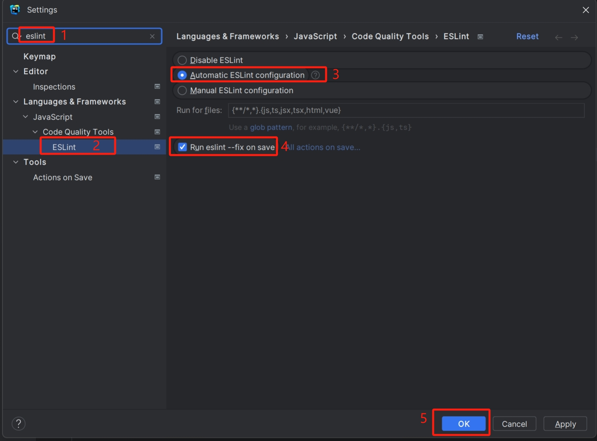

# 代码自动格式化

## 概述

前端开发框架自 `1.5.2` 版本开始根据 [银海前端编码规范](http://172.20.23.216:83/coding/) 集成了一套 [ESLint配置](http://172.20.23.216:83/markdown/viewer.html?md=https%3A%2F%2Flc.yinhaiyun.com%2Fyh-material-unpkg%2F%40yh%2Feslint-config%2FREADME.md) 和 [Prettier配置](http://172.20.23.216:83/markdown/viewer.html?md=https%3A%2F%2Flc.yinhaiyun.com%2Fyh-material-unpkg%2F%40yh%2Fprettier-config%2FREADME.md) ，提供了以下特性：

1. 在 IDE 中对不符合编码规范的代码显示警告或错误提示
2. 代码保存时**自动格式化**
3. 提交代码前自动对改动的代码进行规范检查

上述第 1、2 条特性需要按照此文档后续描述对 IDE 进行少量配置，特性 3 则是开箱即用的。

> 注意！！如果您想在开发中使用 `IDE 编码规范提示` 和 `代码自动格式化` 特性，请确保您的 IDE 满足下述版本要求：
>
> - WebStorm/IDEA：**2021版本及以上** (如果您的 IDE 低于此版本，为了良好的开发体验以及保证代码质量，强烈建议您升级到较新的版本)
> - VS Code：（无明确版本要求，升级至最新版即可）

> 如果您无法升级 WebStorm/IDEA，也可以通过在项目根目录下运行 `pnpm lint-fix` 命令的方式对 `src` 目录下的代码进行代码检查并自动格式化。

## 使用方法

首先请在项目根目录下运行 `pnpm install` 安装项目所需依赖，然后参照下方文档根据你使用的 IDE 选择不同的配置方式。

### VS Code

如果你使用 VS Code 进行开发，只需安装框架推荐的插件即可（安装方式详见：[vscode推荐插件](./vscode推荐插件.md)）。

### WebStorm / IDEA

> 注意：在 WebStorm/IDEA 中，每个项目都需要单独进行配置。

WebStorm/IDEA 默认已内置了必须的插件，只需通过配置将其开启。具体操作步骤如下：

1. 打开配置界面

2. 搜索 `eslint`，勾选 `Automatic ESLint configuration` 和 `Run eslint --fix on save`，然后点击 `OK` 或 `Apply` 应用配置

3. 搜索 `prettier`，勾选 `Automatic Prettier configuration` 和 `Run on save`，然后点击 `OK` 或 `Apply` 应用配置

> 如果你的 IDE 版本较老，可能没有 `Automatic Prettier configuration` 配置项，此时可点击 `Prettier package` 配置项右侧的下拉三角，从当前项目的 `node_modules` 目录下选择 prettier
> 

## 使用反馈

如果您在开发过程中发现代码检查规则或自动格式化规则有不合理的地方，或与 [银海前端编码规范](http://172.20.23.216:83/coding/) 存在冲突，请与 `技术研发部/Ta+3组` 联系。
