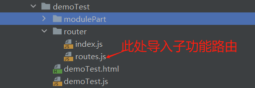

## 项目全局变量规范


项目中预设有一些全局变量和功能。但在使用框架开发过程中，有额外的工具或者场景需要用到全局变量时，请遵循以下规范规则。
### 框架全局变量
框架预设了一些全局变量可使用，比如一下常用的全局变量
#### faceConfig全局变量
faceConfig全局变量挂载在window上，可直接使用，此变量保存了首页的数据配置、前后端交互参数配置、换肤配置等等，具体可在项目根目录下的faceConfig.ts中查看。

#### Base全局变量
框架预设了Base全局变量来提供给用户一些工具方法进行使用，比如Base.submit、Base.getCodeLabel
```js
handleClick(){
Base.submit(form,{
url:'xxx'
})
}
```

#### 全局提示message全局变量
框架预设了全局提示的全局变量，开发者可以直接使用，如下：
```js
handleClick() {
message.info('这里是提示信息') // 直接使用全局变量
this.$message.info('这里是提示信息1') // 也可通过Vue实例来使用
},modal类弹窗全局变量（Vue实例）
用户可通过使用Vue实例来使用弹窗类全局变量的success和confirm
handleClick() {
this.$success({
title: '我是标题',
content: '你好'
})
this.$confirm({
title: '我是标题',
content: '你好'
})
}
```

#### notification通知提醒框全局变量（Vue实例）
框架预设了notification提醒框全局变量，可以通过Vue实例来直接使用
```js
handleClick() {
this.$notification.open({
message: '提醒标题',
description: '提醒的描述',
onClick: () => {
console.log('点击事件');
},
});
}
```


### 自定义全局变量
当有工具方法或者需求要创建全局变量时，应当遵循以下规则
#### 1、创建全局变量工具方法文件（一般为ts/js文件）存放至 cli/projectCommon/src文件夹中


#### 2、在项目模块中引入设置为全局变量
可以在入口模块中引入，并将其挂载为window上的全局变量或者将其挂载在相应模块的原型链上变量名称应当大写

```js
import customUtils from '@projectCommon/customUtils/customCountUtils';

// 将其挂载到window中，并且变量名称应当为大写
window.CUSTOM_UTILS = customUtils
// 其挂载到vue原型链上，名称应当以$开头
Vue.prototype.$CUSTOM_UTILS = customUtils
```

#### 3、使用
定义完成后，可直接在项目中使用  
```js
handleClick() {
// 挂载在window上的全局变量用法
let a = CUSTOM_UTILS.getSurname('杨某人 ')
// 挂载在Vue上的全局变量用法
let b = this.$CUSTOM_UTILS.getSurname('杨某人 ')
}
```
