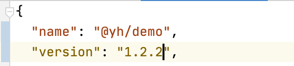
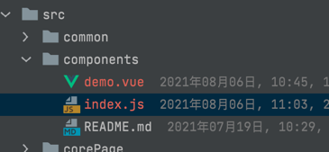
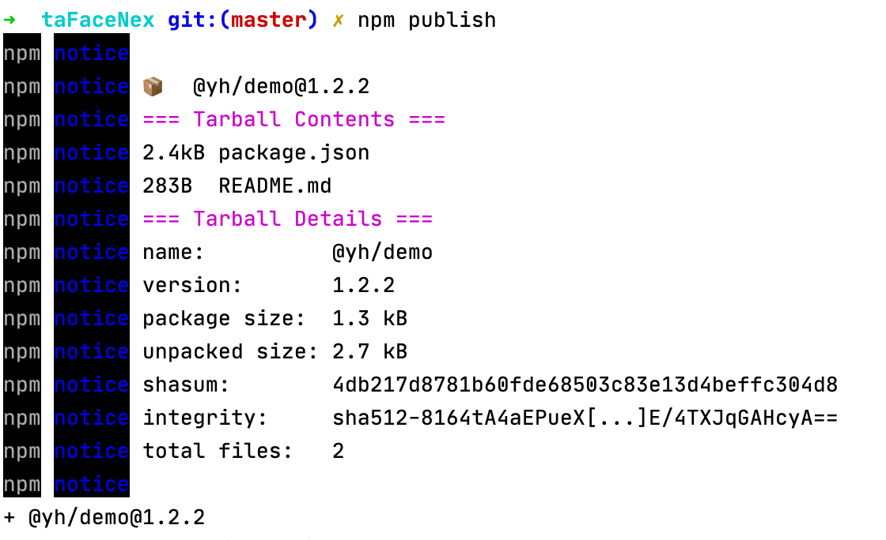
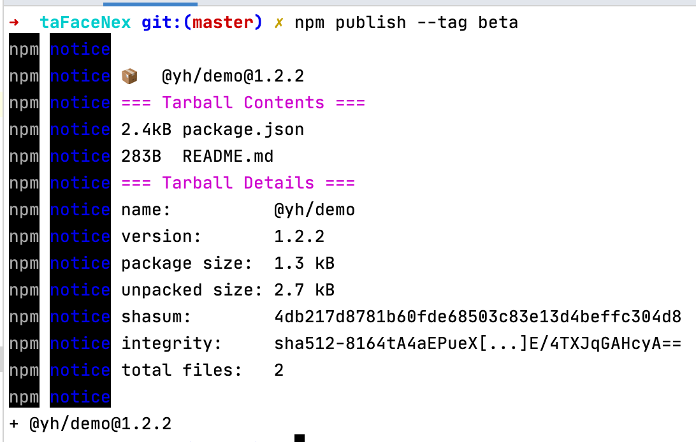

> 【注意】此文档已过时，推荐 [使用物料平台管理自定义组件](./使用物料平台管理自定义组件.md)。

# 在CLI上进行组件开发并发布到公司仓库

## 组件开发
1. 通过`@yh/face-cli`下载`tta404-ui-cli`项目
2. 修改`package.json`的`name`字段为`@`开头的你的组件的名字（这个文档中以`@yh/demo`为例,你也可以使用其他`@`开头的名称,例如`@hf`,`@rshyb`等）
3. 修改`package.json`的`version`字段为你的组件的版本号（版本号可自定义）

4. 在`src/components`目录下添加自己的组件的代码,然后在`index.js`中引入它


**注意:**
- 在确定组件的名字之前,请通过`yarn add **`或`npm install **`来确认你的组件名称没有被占用
- `src/components/index.js`文件不能修改名称,这里是作为打包组件库的入口文件使用的

## 组件测试
1. 可通过当前项目的任意页面进行组件测试

## 组件发布
1. 在开发、测试完成后，需要发布到仓库时，在项目根目录执行`npm run publish:lib`即可发布到公司的仓库仓库。


    **注意：**
    - 发布多个不同版本时，版本号必须不一致且需要满足一定规范
    
### 版本号规范
1. 版本号由3位数字组成，例如`1.2.11`，其中的`1`称为主要版本，`2`称为次要版本，`11`称为修订版本
1. 若此次发布的模块只包含bug的修复，那只需要将修订版本进行增加
1. 若此次发布的模块包含bug的修复、新功能的增加、少数功能的重构（兼容旧版本），那么只需要将次要版本增加，修订版本置为0
1. 若此次发布的模块版本包含不兼容旧版本的更新，那么必须将主要版本提升，次要版本和修订版本置为0
1. 对于仅用于测试的beta版本，那么需要在其版本号的后面添加形似`-1`的标注，1代表beta的版本，并且，在发布时需要使用`npm publish --tag beta`进行发布


## 模块使用

1. 在发布到仓库后，使用者即可通过npm使用你发布的模块。

### 使用方法
1. 以`@yh/demo`为例，

```
// 使用打包后的库
import demo from '@yh/demo' // 引入demo,这里实际上的引入文件为 @yh/demo/dist/index.umd.js
import '@yh/demo/dist/index.css' // 引入样式

// 使用打包前的源码
import demo from '@yh/demo/src/components'

Vue.components(demo) // 注册到Vue实例
```
